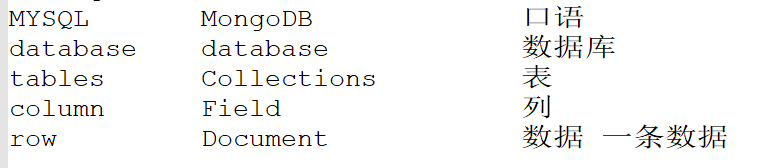

## 数据类型

#### MySQL和MongoDB对比

#### 


```
Object ID ：Documents 自生成的 _id

String： 字符串，必须是utf-8

Boolean：布尔值，true 或者false (这里有坑哦~在我们大Python中 True False 首字母大写)

Integer：整数 (Int32 Int64 你们就知道有个Int就行了,一般我们用Int32)

Double：浮点数 (没有float类型,所有小数都是Double)

Arrays：数组或者列表，多个值存储到一个键 (list哦,大Python中的List哦)

Object：如果你学过Python的话,那么这个概念特别好理解,就是Python中的字典,这个数据类型就是字典

Null：空数据类型 , 一个特殊的概念,None Null

Timestamp：时间戳

Date：存储当前日期或时间unix时间格式 (我们一般不用这个Date类型,时间戳可以秒杀一切时间类型)
```

# 查询操作简单说明

## mongo-driver/bson

bson是一个用于读取，编写和操作BSON的库。 BSON是一种二进制序列化格式，用于在MongoDB中存储文档和进行远程过程调用。

```go
import "go.mongodb.org/mongo-driver/bson"
```

golang 在操作 mongoDB中所有的查询条件、返回字段约束等都是通过 bson.M、bson.A、bson.E、bson.D四个结构进行组装

```go
	//type M map[string]interface{}
	m := bson.M{
		"name": "sue",
		"age": 19,
	}

	//type A []interface{}
	a := bson.A{"blue", "black"}
	
	/**
		type E struct {
			Key   string
			Value interface{}
		}
	**/
	e := bson.E{"key值", "value值"}

	//type D []E
	d := bson.D{e, e}

	fmt.Printf("bson.M:%v \n", m)
	fmt.Printf("bson.A:%v \n", a)
	fmt.Printf("bson.E:%v \n", e)
	fmt.Printf("bson.D:%v \n", d)
/**
		打印输出
		bson.M:map[age:19 name:sue]
		bson.A:[blue black]
		bson.E:{key值 value值}
		bson.D:[{key值 value值} {key值 value值}]
	**/
```


先创建一些基本数据，后边的查询实例，主要依据这些数据

```
db.users.insertMany(
  [
     {
       _id: 1,
       name: "sue",
       age: 19,
       type: 1,
       status: "P",
       favorites: { artist: "Picasso", food: "pizza" },
       finished: [ 17, 3 ],
       badges: [ "blue", "black" ],
       points: [
          { points: 85, bonus: 20 },
          { points: 85, bonus: 10 }
       ]
     },
     {
       _id: 2,
       name: "bob",
       age: 42,
       type: 1,
       status: "A",
       favorites: { artist: "Miro", food: "meringue" },
       finished: [ 11, 25 ],
       badges: [ "green" ],
       points: [
          { points: 85, bonus: 20 },
          { points: 64, bonus: 12 }
       ]
     },
     {
       _id: 3,
       name: "ahn",
       age: 22,
       type: 2,
       status: "A",
       favorites: { artist: "Cassatt", food: "cake" },
       finished: [ 6 ],
       badges: [ "blue", "red" ],
       points: [
          { points: 81, bonus: 8 },
          { points: 55, bonus: 20 }
       ]
     },
     {
       _id: 4,
       name: "xi",
       age: 34,
       type: 2,
       status: "D",
       favorites: { artist: "Chagall", food: "chocolate" },
       finished: [ 5, 11 ],
       badges: [ "red", "black" ],
       points: [
          { points: 53, bonus: 15 },
          { points: 51, bonus: 15 }
       ]
     },
     {
       _id: 5,
       name: "xyz",
       age: 23,
       type: 2,
       status: "D",
       favorites: { artist: "Noguchi", food: "nougat" },
       finished: [ 14, 6 ],
       badges: [ "orange" ],
       points: [
          { points: 71, bonus: 20 }
       ]
     },
     {
       _id: 6,
       name: "abc",
       age: 43,
       type: 1,
       status: "A",
       favorites: { food: "pizza", artist: "Picasso" },
       finished: [ 18, 12 ],
       badges: [ "black", "blue" ],
       points: [
          { points: 78, bonus: 8 },
          { points: 57, bonus: 7 }
       ]
     }
  ]
)
```

## 选择集合中的所有文档

一个空的 [*query filter*](https://mongoing.com/docs/core/document.html#document-query-filter) 文档（`{}`） 选择集合中的所有文档：

```shell
# mongoDB命令行
db.users.find( {} )
```

省略 [`db.collection.find()`](https://mongoing.com/docs/reference/method/db.collection.find.html#db.collection.find) 中的查询过滤文档等价于指定一个空的查询文档。因此，下面的操作等价于之前的操作：

```
db.users.find()
```

```go
//go语言中
ctx := context.TODO()
//filter 想当于mysql where条件
filter :=  bson.M{}
cursor, err := db.Collection("users").Find(ctx, filter)
```


## 指定查询过滤条件

### 指定等于条件

一个 [*query filter document*](https://mongoing.com/docs/core/document.html#document-query-filter) 可以使用 `<field>:<value>` 表达式指定等于条件以选择所有包含 `<field>` 字段并且等于特定 `<value>` 的所有文档：

```
{ <field1>: <value1>, ... }
```

下面的示例从 `user` 集合中检索 `status` 字段值为 `"A"` 的所有文档：

```shell
# mongoDB命令行
db.users.find( { status: "A" } )
```

```go
//go语言中
//mysql where status = "A"
filter :=  bson.M{
  "status": "A",
}
cursor, err := db.Collection("users").Find(ctx, filter)
```


### 使用查询操作符指定条件

A [*query filter document*](https://mongoing.com/docs/core/document.html#document-query-filter) can use the [*query operators*](https://mongoing.com/docs/reference/operator/query.html#query-selectors) to specify conditions in the following form:

```shell
# mongoDB命令行
# where field operator value
{ <field1>: { <operator1>: <value1> }, ... }
```

下面的示例从 `user` 集合中检索 `status` 字段值为 `"P"` 或者 `"D"` 的所有文档：

```shell
# mongoDB命令行
db.users.find( { status: { $in: [ "P", "D" ] } } )
```

```go
//go语言中
//mysql where status in ("P", "D")
filter :=  bson.M{
  "status": bson.M{
    "$in": bson.A{"P", "D"},
  },
}
cursor, err := db.Collection("users").Find(ctx, filter)
```


尽管你也可以使用 [`$or`](https://mongoing.com/docs/reference/operator/query/or.html#op._S_or) 操作符表示这个查询，但是在相同字段执行等于检查时，建议使用 [`$in`](https://mongoing.com/docs/reference/operator/query/in.html#op._S_in) 而不是 [`$or`](https://mongoing.com/docs/reference/operator/query/or.html#op._S_or) 。

查阅 [*Query and Projection Operators*](https://mongoing.com/docs/reference/operator/query.html) 文档了解查询操作符的完整列表。

### 指定 `AND` 条件

复合查询可以在集合文档的多个字段上指定条件。隐含地，一个逻辑的 `AND` 连接词会连接复合查询的子句，使得查询选出集合中匹配所有条件的文档。

下面的示例在 `users` 集合中检索 `status` 等于 `"A"``**并且** ``age` 小于 ([`$lt`](https://mongoing.com/docs/reference/operator/query/lt.html#op._S_lt)) `30` 是所有文档：

```shell
# mongoDB命令行
db.users.find( { status: "A", age: { $lt: 30 } } )
```

```go
//go语言中
//mysql where status = "A" and age < 30
filter :=  bson.M{
  "status": "A",
  "age": bson.M{
    "$lt": 30,
  },
}
cursor, err := db.Collection("users").Find(ctx, filter)
```


查阅 [*comparison operators*](https://mongoing.com/docs/reference/operator/query-comparison.html#query-selectors-comparison) 了解其它比较操作符。

### 指定 `OR` 条件

通过使用 [`$or`](https://mongoing.com/docs/reference/operator/query/or.html#op._S_or) 操作符，你可以指定一个使用逻辑 `OR` 连接词连接各子句的复合查询选择集合中匹配至少一个条件的文档。

下面的示例在 `users` 集合中检索 `status` 等于 `"A"``**或者** ``age` 小于 ([`$lt`](https://mongoing.com/docs/reference/operator/query/lt.html#op._S_lt)) `30` 是所有文档：

```shell
# mongoDB命令行
db.users.find(
   {
     $or: [ { status: "A" }, { age: { $lt: 30 } } ]
   }
)
```

```go
//go语言中
//mysql where status = "A" or age < 30
filter :=  bson.M{
  "$or": bson.A{
    bson.M{"status", "A"},
    bson.M{
      "age": bson.M{
        "$lt": 30
      },
    },
  },
}
cursor, err := db.Collection("users").Find(ctx, filter)
```


注解

使用 [*comparison operators*](https://mongoing.com/docs/reference/operator/query-comparison.html#query-selectors-comparison) 的查询服从 [*Type Bracketing*](https://mongoing.com/docs/reference/method/db.collection.find.html#type-bracketing) 。

### 指定 `AND` 和 `OR` 条件

通过使用附加的子句，你可以指定匹配文档的精确条件。

“在下面的示例中，复合查询文档选择集合中`status`` 等于 `"A"` **并且** *要么* `age` 小于 ([`$lt`](https://mongoing.com/docs/reference/operator/query/lt.html#op._S_lt)) `30` *要么* `type` 等于 `1` 的所有文档：

```shell
# mongoDB命令行
db.users.find(
   {
     status: "A",
     $or: [ { age: { $lt: 30 } }, { type: 1 } ]
   }
)
```

```go
//go语言中
//mysql where status = "A" and (age < 30 or type = 1)
filter :=  bson.M{
  "status": "A",
  "$or": bson.A{
    bson.M{
      "age": bson.M{
        "$lt":30
      },
    },
    bson.M{
      "type": 1
    },
  },
}
cursor, err := db.Collection("users").Find(ctx, filter)
```


## 嵌入文档上的查询

当字段中包含嵌入文档时，查询可以指定嵌入文档中的精确匹配或者使用 “[*dot notation*](https://mongoing.com/docs/reference/glossary.html#term-dot-notation) 对嵌入文档中的单个字段指定匹配。

### 嵌入文档上的精确匹配

使用``{ <field>: <value> }``并且 “<value>” 为要匹配文档的查询文档，来指定匹配整个内嵌文档的完全相等条件.(要使)相等条件匹配上内嵌文档需要指定 `<value>` 包括字段顺序的 *精确* 匹配。

在下面的例子中,查询匹配所有 `favorites` 字段是以该种**顺序**只包含 等于 `"Picasso"``的 ``artist` 和等于 `"pizza"` 的 `food` 字段的内嵌文档：

注意：**有序性**，值相等还不行，顺序还必须一致；

```shell
# mongoDB命令行
db.users.find( { favorites: { artist: "Picasso", food: "pizza" } } )
```

```go
//go语言中
//mysql where favorites.artist = "Picasso" and favorites.food = "pizza"
filter :=  bson.M{
  "favorites": bson.M{
    "artist": "Picasso", 
    "food": "pizza" ,
  },
}
cursor, err := db.Collection("users").Find(ctx, filter)
```

查询匹配下面的文档：

```json
//只会查出下面这条数据
//favorites中food、artist值和顺序都满足条件
{
    "_id" : 1.0,
    "name" : "sue",
    "age" : 19.0,
    "type" : 1.0,
    "status" : "P",
    "favorites" : {
        "artist" : "Picasso",
        "food" : "pizza"
    },
    "finished" : [ 
        17.0, 
        3.0
    ],
    "badges" : [ 
        "blue", 
        "black"
    ],
    "points" : [ 
        {
            "points" : 85.0,
            "bonus" : 20.0
        }, 
        {
            "points" : 85.0,
            "bonus" : 10.0
        }
    ]
}

//_id=6 的数据查不出来，因为favorites中food、artist顺序不满足条件
{
    "_id" : 6.0,
    "name" : "abc",
    "age" : 43.0,
    "type" : 1.0,
    "status" : "A",
    "favorites" : {
        "food" : "pizza",
        "artist" : "Picasso"
    },
    "finished" : [ 
        18.0, 
        12.0
    ],
    "badges" : [ 
        "black", 
        "blue"
    ],
    "points" : [ 
        {
            "points" : 78.0,
            "bonus" : 8.0
        }, 
        {
            "points" : 57.0,
            "bonus" : 7.0
        }
    ]
}
```


### 嵌入文档中字段上的等于匹配

使用 [*dot notation*](https://mongoing.com/docs/reference/glossary.html#term-dot-notation) 匹配内嵌文档中的特定的字段。内嵌文档中特定字段的相等匹配将筛选出集合中内嵌文档包含该指定字段并等于指定的值的文档。内嵌文档可以包含其他的字段。

在下面的例子中,查询使用 [*dot notation*](https://mongoing.com/docs/reference/glossary.html#term-dot-notation) 匹配所有 `favorites` 字段是包含等于 `"Picasso"` 的字段 [``](https://mongoing.com/docs/tutorial/query-documents.html#id1)artist``(可能还包含其他字段) 的内嵌文档：

```shell
# mongoDB命令行
db.users.find( { "favorites.artist": "Picasso" } )
```

```go
//go语言中
//mysql where favorites.artist = "Picasso"
filter :=  bson.M{
  "favorites.artist": "Picasso",
}
cursor, err := db.Collection("users").Find(ctx, filter)
```

查询匹配下面的文档：

```json
/* 1 */
{
    "_id" : 1.0,
    "name" : "sue",
    "age" : 19.0,
    "type" : 1.0,
    "status" : "P",
    "favorites" : {
        "artist" : "Picasso",
        "food" : "pizza"
    },
    "finished" : [ 
        17.0, 
        3.0
    ],
    "badges" : [ 
        "blue", 
        "black"
    ],
    "points" : [ 
        {
            "points" : 85.0,
            "bonus" : 20.0
        }, 
        {
            "points" : 85.0,
            "bonus" : 10.0
        }
    ]
}

/* 2 */
{
    "_id" : 6.0,
    "name" : "abc",
    "age" : 43.0,
    "type" : 1.0,
    "status" : "A",
    "favorites" : {
        "food" : "pizza",
        "artist" : "Picasso"
    },
    "finished" : [ 
        18.0, 
        12.0
    ],
    "badges" : [ 
        "black", 
        "blue"
    ],
    "points" : [ 
        {
            "points" : 78.0,
            "bonus" : 8.0
        }, 
        {
            "points" : 57.0,
            "bonus" : 7.0
        }
    ]
}
```


## 数组上的查询

当字段包含数组，你可查询精确的匹配数组或数组中特定的值。如果数组包含嵌入文档，你可以使用 [*dot notation*](https://mongoing.com/docs/reference/glossary.html#term-dot-notation) 查询内嵌文档中特定的字段。

如果你使用 [`$elemMatch`](https://mongoing.com/docs/reference/operator/query/elemMatch.html#op._S_elemMatch) 操作符指定多个查询条件，数组必须包含至少一个元素满足所有条件。参见 [*单个元素满足查询条件*](https://mongoing.com/docs/tutorial/query-documents.html#single-element-satisfies-criteria)。

如果指定多个查询条件时没有使用 [`$elemMatch`](https://mongoing.com/docs/reference/operator/query/elemMatch.html#op._S_elemMatch) 操作符，那么数组元素的组合（不一定是单一元素）必须满足所有条件；例如，数组中的不同元素可以满足条件的不同部门。查阅 [*元素组合满足查询条件*](https://mongoing.com/docs/tutorial/query-documents.html#combination-of-elements-satisfies-criteria) 了解更多信息。


### 数组上的精确匹配

要指定数组相等匹配，使用查询文档 `{ <field>: <value> }` 其中 `<value>` 是匹配的数组。数组的相等匹配要求数组字段与指定的匹配数组 `<value>` *完全* 相符，包括数组元素的顺序。

下面的例子查询所有字段 `badges` 是一个正好有两个元素: `"blue"` 和 `"black"` (以这种**顺序**)的数组的文档：

```shell
# mongoDB命令行
db.users.find( { badges: [ "blue", "black" ] } )
```

```go
//go语言中
//mysql where badges = blue + black
filter :=  bson.M{
  "badges": bson.A{"blue", "black"},
}
cursor, err := db.Collection("users").Find(ctx, filter)
```


查询匹配下面的文档：

```json
//只会查出下面这条数据
//badges 值和顺序都满足条件
{
   "_id" : 1,
   "name" : "sue",
   "age" : 19,
   "type" : 1,
   "status" : "P",
   "favorites" : { "artist" : "Picasso", "food" : "pizza" },
   "finished" : [ 17, 3 ]
   "badges" : [ "blue", "black" ],
   "points" : [ { "points" : 85, "bonus" : 20 }, { "points" : 85, "bonus" : 10 } ]
}

// 下面的文档 badges 值的顺序不对查询不出来
{
    "_id" : 6.0,
    "name" : "abc",
    "age" : 43.0,
    "type" : 1.0,
    "status" : "A",
    "favorites" : {
        "food" : "pizza",
        "artist" : "Picasso"
    },
    "finished" : [ 
        18.0, 
        12.0
    ],
    "badges" : [ 
        "black", 
        "blue"
    ],
    "points" : [ 
        {
            "points" : 78.0,
            "bonus" : 8.0
        }, 
        {
            "points" : 57.0,
            "bonus" : 7.0
        }
    ]
}
```


### 匹配一个数组元素

等于匹配可以指定匹配数组中的单一元素。如果数组中至少 *一个* 元素包含特定的值，就可以匹配这些声明。

下面的示例查询 `badges` 是一个数组字段并且包含 [``](https://mongoing.com/docs/tutorial/query-documents.html#id1)“black”[``](https://mongoing.com/docs/tutorial/query-documents.html#id3)作为其数组元素的所有文档。

```shell
# mongoDB命令行
db.users.find( { badges: "black" } )
```

```json
//go语言中
filter :=  bson.M{
  "badges": "black",
}
cursor, err := db.Collection("users").Find(ctx, filter)
```


查询匹配下列文档：

```json
{
   "_id" : 1,
   "name" : "sue",
   "age" : 19,
   "type" : 1,
   "status" : "P",
   "favorites" : { "artist" : "Picasso", "food" : "pizza" },
   "finished" : [ 17, 3 ]
   "badges" : [ "blue", "black" ],
   "points" : [ { "points" : 85, "bonus" : 20 }, { "points" : 85, "bonus" : 10 } ]
}
{
   "_id" : 4,
   "name" : "xi",
   "age" : 34,
   "type" : 2,
   "status" : "D",
   "favorites" : { "artist" : "Chagall", "food" : "chocolate" },
   "finished" : [ 5, 11 ],
   "badges" : [ "red", "black" ],
   "points" : [ { "points" : 53, "bonus" : 15 }, { "points" : 51, "bonus" : 15 } ]
}
{
   "_id" : 6,
   "name" : "abc",
   "age" : 43,
   "type" : 1,
   "status" : "A",
   "favorites" : { "food" : "pizza", "artist" : "Picasso" },
   "finished" : [ 18, 12 ],
   "badges" : [ "black", "blue" ],
   "points" : [ { "points" : 78, "bonus" : 8 }, { "points" : 57, "bonus" : 7 } ]
}
```

### 匹配数组中的指定元素

等于匹配可以指定匹配数组某一特定所有或位置的元素，使用 [*dot notation*](https://mongoing.com/docs/reference/glossary.html#term-dot-notation) 。

在下面的例子中,查询使用 the [*dot notation*](https://mongoing.com/docs/reference/glossary.html#term-dot-notation) 匹配所有 `dadges` 数组的第一个元素为``”black”`` 的文档:

```shell
# mongoDB命令行
# badges 数组中第一个元素必须是 black
db.users.find( { "badges.0": "black" } )
```

```go
//go语言中
filter :=  bson.M{
  "badges.0": "black",
}
cursor, err := db.Collection("users").Find(ctx, filter)
```


该操作返回下列文档：

```json
{
   "_id" : 6,
   "name" : "abc",
   "age" : 43,
   "type" : 1,
   "status" : "A",
   "favorites" : { "food" : "pizza", "artist" : "Picasso" },
   "finished" : [ 18, 12 ],
   "badges" : [ "black", "blue" ],
   "points" : [ { "points" : 78, "bonus" : 8 }, { "points" : 57, "bonus" : 7 } ]
}
```


### 指定数组元素的多个查询条件

#### 单个元素满足查询条件

使用 [`$elemMatch`](https://mongoing.com/docs/reference/operator/query/elemMatch.html#op._S_elemMatch) 操作符为数组元素指定复合条件，以查询数组中**至少一个**元素**满足所有指定条件**的文档。

下面的例子查询 `finished` 数组至少包含一个大于 ([`$gt`](https://mongoing.com/docs/reference/operator/query/gt.html#op._S_gt)) `15` **并且**小于 ([`$lt`](https://mongoing.com/docs/reference/operator/query/lt.html#op._S_lt)) `20` 的元素的文档：

```shell
# mongoDB命令行
# finished 数组中至少有一个 元素 满足 $elemMatch 限定的条件
db.users.find( { finished: { $elemMatch: { $gt: 15, $lt: 20 } } } )
```

```go
//go语言中
filter :=  bson.M{
  "finished": bson.M{
    "$elemMatch": bson.M{
      "$gt": 15,
      "$lt": 20,
    }
  },
}
cursor, err := db.Collection("users").Find(ctx, filter)
```


操作返回下列文档，文档的 `finished` 数组包含至少一个满足查询条件的元素。

```json
{
   "_id" : 1,
   "name" : "sue",
   "age" : 19,
   "type" : 1,
   "status" : "P",
   "favorites" : { "artist" : "Picasso", "food" : "pizza" },
   "finished" : [ 17, 3 ]
   "badges" : [ "blue", "black" ],
   "points" : [ { "points" : 85, "bonus" : 20 }, { "points" : 85, "bonus" : 10 } ]
}
{
   "_id" : 6,
   "name" : "abc",
   "age" : 43,
   "type" : 1,
   "status" : "A",
   "favorites" : { "food" : "pizza", "artist" : "Picasso" },
   "finished" : [ 18, 12 ],
   "badges" : [ "black", "blue" ],
   "points" : [ { "points" : 78, "bonus" : 8 }, { "points" : 57, "bonus" : 7 } ]
}
```


#### 元素组合满足查询条件

下面的例子查询 `finished` 数组包含以某种组合满足查询条件的元素的文档;例如,一个元素满足大于 `15` 的条件并且有另一个元素满足小于 `20` 的条件,或者有一个元素满足了这两个条件：

```shell
# mongoDB命令行
db.users.find( { finished: { $gt: 15, $lt: 20 } } )
```

```go
//go语言中
filter :=  bson.M{
  "finished": bson.M{
    "$gt": 15,
    "$lt": 20,
  },
}
cursor, err := db.Collection("users").Find(ctx, filter)
```


操作返回下面的文档：

```json
{
   "_id" : 1,
   "name" : "sue",
   "age" : 19,
   "type" : 1,
   "status" : "P",
   "favorites" : { "artist" : "Picasso", "food" : "pizza" },
   "finished" : [ 17, 3 ]
   "badges" : [ "blue", "black" ],
   "points" : [ { "points" : 85, "bonus" : 20 }, { "points" : 85, "bonus" : 10 } ]
}
{
   "_id" : 2,
   "name" : "bob",
   "age" : 42,
   "type" : 1,
   "status" : "A",
   "favorites" : { "artist" : "Miro", "food" : "meringue" },
   "finished" : [ 11, 20 ],
   "badges" : [ "green" ],
   "points" : [ { "points" : 85, "bonus" : 20 }, { "points" : 64, "bonus" : 12 } ]
}
{
   "_id" : 6,
   "name" : "abc",
   "age" : 43,
   "type" : 1,
   "status" : "A",
   "favorites" : { "food" : "pizza", "artist" : "Picasso" },
   "finished" : [ 18, 12 ],
   "badges" : [ "black", "blue" ],
   "points" : [ { "points" : 78, "bonus" : 8 }, { "points" : 57, "bonus" : 7 } ]
}
```


### 嵌入文档数组

#### 使用数组索引匹配嵌入文档中的字段

在下面的例子中,查询使用 the [*dot notation*](https://mongoing.com/docs/reference/glossary.html#term-dot-notation) 匹配所有 `dadges` 是第一个元素为``”black”`` 的数组的文档:

如果你知道内嵌文档的数组索引，你可以使用 [*dot notation*](https://mongoing.com/docs/reference/glossary.html#term-dot-notation) 及内嵌文档的位置指定文档。

```shell
# mongoDB命令行
db.users.find( { 'points.0.points': { $lte: 55 } } )
```

```go
//go语言中
filter :=  bson.M{
  "points.0.points": bson.M{
    "$lte": 55,
  },
}
cursor, err := db.Collection("users").Find(ctx, filter)
```


操作返回下面的文档：

```json
{
   "_id" : 4,
   "name" : "xi",
   "age" : 34,
   "type" : 2,
   "status" : "D",
   "favorites" : { "artist" : "Chagall", "food" : "chocolate" },
   "finished" : [ 5, 11 ],
   "badges" : [ "red", "black" ],
   "points" : [ { "points" : 53, "bonus" : 15 }, { "points" : 51, "bonus" : 15 } ]
}
```

#### 不指定数组索引匹配字段

如果你不知道文档在数组中的索引位置，用点号 (`.`) 将包含数组的字段的名字和内嵌文档的字段的名字连起来。

下面的例子选择出所有 ``points``数组中**至少**有一个嵌入文档包含值小于或等于 ``55`` 的字段 `points` 的文档:

```shell
# mongoDB命令行
db.users.find( { 'points.points': { $lte: 55 } } )
```

```go
//go语言中
filter :=  bson.M{
  "points.points": bson.M{
    "$lte": 55,
  },
}
cursor, err := db.Collection("users").Find(ctx, filter)
```


操作返回下面的文档：

```json
{
   "_id" : 3,
   "name" : "ahn",
   "age" : 22,
   "type" : 2,
   "status" : "A",
   "favorites" : { "artist" : "Cassatt", "food" : "cake" },
   "finished" : [ 6 ],
   "badges" : [ "blue", "red" ],
   "points" : [ { "points" : 81, "bonus" : 8 }, { "points" : 55, "bonus" : 20 } ]
}
{
   "_id" : 4,
   "name" : "xi",
   "age" : 34,
   "type" : 2,
   "status" : "D",
   "favorites" : { "artist" : "Chagall", "food" : "chocolate" },
   "finished" : [ 5, 11 ],
   "badges" : [ "red", "black" ],
   "points" : [ { "points" : 53, "bonus" : 15 }, { "points" : 51, "bonus" : 15 } ]
}
```


### 指定数组文档的多个查询条件

#### 单个元素满足查询条件

使用 [`$elemMatch`](https://mongoing.com/docs/reference/operator/query/elemMatch.html#op._S_elemMatch) 操作符为数组元素指定复合条件，以查询数组中**至少一个**元素**满足所有指定条件**的文档。

下面的例子查询 `points` 数组有至少一个包含 `points` 小于等于 `70` 并且字段 `bonus` 等于 `20` 的内嵌文档的文档：

```shell
# mongoDB命令行
db.users.find( { points: { $elemMatch: { points: { $lte: 70 }, bonus: 20 } } } )
```

```go
//go语言中
filter :=  bson.M{
  "points": bson.M{
    "$elemMatch": bson.M{
    	"points": bson.M{"$lte": 70},
    	"bonus": 20,
    },
  },
}
cursor, err := db.Collection("users").Find(ctx, filter)
```


该操作返回下列文档：

```json
{
   "_id" : 3,
   "name" : "ahn",
   "age" : 22,
   "type" : 2,
   "status" : "A",
   "favorites" : { "artist" : "Cassatt", "food" : "cake" },
   "finished" : [ 6 ],
   "badges" : [ "blue", "red" ],
   "points" : [ { "points" : 81, "bonus" : 8 }, { "points" : 55, "bonus" : 20 } ]
}
```

#### 元素组合满足查询条件

下面的例子查询了 `points` 数组包含了以某种组合满足查询条件的元素的文档；例如，一个元素满足 `points` 小于等于 `70` 的条件并且有另一个元素满足 `bonus` 等于 `20` 的条件，或者一个元素同时满足两个条件：

```shell
# mongoDB命令行
db.users.find( { "points.points": { $lte: 70 }, "points.bonus": 20 } )
```

```go
//go语言中
filter :=  bson.M{
  "points.points": bson.M{
    "points": bson.M{"$lte": 70},
    "bonus": 20,
  },
}
cursor, err := db.Collection("users").Find(ctx, filter)
```


查询返回下列文档：

```json
{
   "_id" : 2,
   "name" : "bob",
   "age" : 42,
   "type" : 1,
   "status" : "A",
   "favorites" : { "artist" : "Miro", "food" : "meringue" },
   "finished" : [ 11, 20 ],
   "badges" : [ "green" ],
   "points" : [ { "points" : 85, "bonus" : 20 }, { "points" : 64, "bonus" : 12 } ]
}
{
   "_id" : 3,
   "name" : "ahn",
   "age" : 22,
   "type" : 2,
   "status" : "A",
   "favorites" : { "artist" : "Cassatt", "food" : "cake" },
   "finished" : [ 6 ],
   "badges" : [ "blue", "red" ],
   "points" : [ { "points" : 81, "bonus" : 8 }, { "points" : 55, "bonus" : 20 } ]
}
```

## 返回查询的映射字段

### 映射文档

映射文档限制了返回所有匹配文档的字段。映射文档可以指明包括哪些字段或者排除哪些字段，有以下形式：

```shell
{ field1: <value>, field2: <value> ... }
```

The `<value>` can be any of the following:

- `1` 或 `true` 在返回的文档中包含字段。
- `0` 或者 `false` 排除该字段。
- 使用 [*Projection Operators*](https://mongoing.com/docs/reference/operator/projection.html) 的表达式。

### 返回匹配文档的所有字段

如果您没有指定映射， [`db.collection.find()`](https://mongoing.com/docs/reference/method/db.collection.find.html#db.collection.find) 方法将会返回满足查询的所有文档的所有字段。

下面的案例从 `users` 集合中检索 `status` 为 `"A"` 的所有文档。

```shell
# mongoDB命令行
db.users.find( { status: "A" } )
```

### 只返回指定的字段及 `_id` 字段

一个映射可以显式地包含几个字段，在下面的操作中， [`db.collection.find()`](https://mongoing.com/docs/reference/method/db.collection.find.html#db.collection.find) 方法返回满足查询的所有文档。在结果集中，只返回了匹配文档的 `name` ， `status` 以及默认的 `_id` 字段。

```shell
# mongoDB命令行
db.users.find( { status: "A" }, { name: 1, status: 1 } )
```

```go
//go语言中
filter := "过滤条件就不在赘述"
projection := bson.M{
  "name": 1,
  "status": 1,
}
option := options.Find().SetProjection(projection)
cursor, err := db.Collection("users").Find(ctx, filter, option)
```


上面的操作返回下列结果：

```json
{ "_id" : 2, "name" : "bob", "status" : "A" }
{ "_id" : 3, "name" : "ahn", "status" : "A" }
{ "_id" : 6, "name" : "abc", "status" : "A" }
```

### 只返回指定的字段

您可以通过在映射中指定排除的字段删除结果中的 `_id` 字段，如下面的案例所示：

```shell
# mongoDB命令行
db.users.find( { status: "A" }, { name: 1, status: 1, _id: 0 } )
```

```go
//go语言中
filter := "过滤条件就不在赘述"
projection := bson.M{
  "name": 1,
  "status": 1,
  "_id": 0,
}
option := options.Find().SetProjection(projection)
cursor, err := db.Collection("users").Find(ctx, filter, option)
```


在结果集中，*只* 返回匹配文档中的 `name` 和 `status` 字段。

```json
{ "name" : "bob", "status" : "A" }
{ "name" : "ahn", "status" : "A" }
{ "name" : "abc", "status" : "A" }
```

### 返回除了排除字段之外的所有字段

为了排除一个或多个字段，而不是列出在匹配文档中列出的字段，您可以像下列示例中一样，使用一个映射来排除特定的字段：

```shell
# mongoDB命令行
db.users.find( { status: "A" }, { favorites: 0, points: 0 } )
```

```go
//go语言中
filter := "过滤条件就不在赘述"
projection := bson.M{
  "favorites": 0,
  "points": 0,
}
option := options.Find().SetProjection(projection)
cursor, err := db.Collection("users").Find(ctx, filter, option)
```


在结果集中， favorites 和 points 字段不在匹配文档中返回。

```json
{
   "_id" : 2,
   "name" : "bob",
   "age" : 42,
   "type" : 1,
   "status" : "A",
   "finished" : [ 11, 25 ],
   "badges" : [ "green" ]
}
{
   "_id" : 3,
   "name" : "ahn",
   "age" : 22,
   "type" : 2,
   "status" : "A",
   "finished" : [ 6 ],
   "badges" : [ "blue", "red" ]
}
{
   "_id" : 6,
   "name" : "abc",
   "age" : 43,
   "type" : 1,
   "status" : "A",
   "finished" : [ 18, 12 ],
   "badges" : [ "black", "blue" ]
}
```

除了 _id 字段，您不能在映射文档中组合 包含和排除 语句。

### 返回嵌入文档中的指定字段

使用 [*dot notation*](https://mongoing.com/docs/core/document.html#document-dot-notation) 返回嵌入文档中的特定字段

下面的示例指定了一个映射，返回 `_id` 字段、`name` 字段、 `status` 字段以及 `favorites` 文档中的 `food` 字段， `food` 仍然保持嵌入在 `favorites` 文档中。

```shell
# mongoDB命令行
db.users.find(
   { status: "A" },
   { name: 1, status: 1, "favorites.food": 1 }
)
```

```go
//go语言中
filter := "过滤条件就不在赘述"
projection := bson.M{
  "name": 1,
  "status": 1,
  "favorites.food": 1
}
option := options.Find().SetProjection(projection)
cursor, err := db.Collection("users").Find(ctx, filter, option)
```


上面的操作返回下列结果：

```json
{ "_id" : 2, "name" : "bob", "status" : "A", "favorites" : { "food" : "meringue" } }
{ "_id" : 3, "name" : "ahn", "status" : "A", "favorites" : { "food" : "cake" } }
{ "_id" : 6, "name" : "abc", "status" : "A", "favorites" : { "food" : "pizza" } }
```

### 排除嵌入文档中的特定字段

Use [*dot notation*](https://mongoing.com/docs/core/document.html#document-dot-notation) to suppress specific fields of an embedded document using a `0` instead of `1`.

下面的示例指明了排除 `favorites` 文档中 `food` 字段的映射。所有其他字段都会在匹配的文档中返回：

```shell
# mongoDB命令行
db.users.find(
   { status: "A" },
   { "favorites.food": 0 }
)
```

```go
//go语言中
filter := "过滤条件就不在赘述"
projection := bson.M{
  "favorites.food": 0
}
option := options.Find().SetProjection(projection)
cursor, err := db.Collection("users").Find(ctx, filter, option)
```


操作返回下列文档：

```json
{
   "_id" : 2,
   "name" : "bob",
   "age" : 42,
   "type" : 1,
   "status" : "A",
   "favorites" : { "artist" : "Miro" },
   "finished" : [ 11, 25 ],
   "badges" : [ "green" ],
   "points" : [ { "points" : 85, "bonus" : 20 }, { "points" : 64, "bonus" : 12 } ]
}
{
   "_id" : 3,
   "name" : "ahn",
   "age" : 22,
   "type" : 2,
   "status" : "A",
   "favorites" : { "artist" : "Cassatt" },
   "finished" : [ 6 ],
   "badges" : [ "blue", "red" ],
   "points" : [ { "points" : 81, "bonus" : 8 }, { "points" : 55, "bonus" : 20 } ]
}
{
   "_id" : 6,
   "name" : "abc",
   "age" : 43,
   "type" : 1,
   "status" : "A",
   "favorites" : { "artist" : "Picasso" },
   "finished" : [ 18, 12 ],
   "badges" : [ "black", "blue" ],
   "points" : [ { "points" : 78, "bonus" : 8 }, { "points" : 57, "bonus" : 7 } ]
}
```

### 映射数组中的嵌入文档

使用 [*dot notation*](https://mongoing.com/docs/core/document.html#document-dot-notation) 映射嵌入在数组中文档的特定字段。

下面的示例指明映射返回 `name` 字段、 `status` 字段，以及 `points` 数组的文档中包含 `bonus` 字段的文档。 默认返回 `_id` 。

```shell
# mongoDB命令行
db.users.find( { status: "A" }, { name: 1, status: 1, "points.bonus": 1 } )
```

```go
//go语言中
filter := "过滤条件就不在赘述"
projection := bson.M{
  "name": 1,
  "status": 1,
  "points.bonus": 1,
}
option := options.Find().SetProjection(projection)
cursor, err := db.Collection("users").Find(ctx, filter, option)
```


上面的操作返回下列结果：

```json
{ "_id" : 2, "name" : "bob", "status" : "A", "points" : [ { "bonus" : 20 }, { "bonus" : 12 } ] }
{ "_id" : 3, "name" : "ahn", "status" : "A", "points" : [ { "bonus" : 8 }, { "bonus" : 20 } ] }
{ "_id" : 6, "name" : "abc", "status" : "A", "points" : [ { "bonus" : 8 }, { "bonus" : 7 } ] }
```

### 映射返回数组中特定的数组元素

对于包含数组的字段，MongoDB提供了下面的映射操作符： [`$elemMatch`](https://mongoing.com/docs/reference/operator/projection/elemMatch.html#proj._S_elemMatch), [`$slice`](https://mongoing.com/docs/reference/operator/projection/slice.html#proj._S_slice), 以及 [`$`](https://mongoing.com/docs/reference/operator/projection/positional.html#proj._S_) 。

下面的示例使用 [`$slice`](https://mongoing.com/docs/reference/operator/projection/slice.html#proj._S_slice) 映射操作符来返回 `scores` 数组中最后的元素。

```shell
db.users.find( { status: "A" }, { name: 1, status: 1, points: { $slice: -1 } } )
```

```go
//go语言中
filter := "过滤条件就不在赘述"
projection := bson.M{
  "name": 1,
  "status": 1,
  "points": bson.M{
    "$slice": -1
  },
}
option := options.Find().SetProjection(projection)
cursor, err := db.Collection("users").Find(ctx, filter, option)
```


上面的操作返回下列结果：

```json
{ "_id" : 2, "name" : "bob", "status" : "A", "points" : [ { "points" : 64, "bonus" : 12 } ] }
{ "_id" : 3, "name" : "ahn", "status" : "A", "points" : [ { "points" : 55, "bonus" : 20 } ] }
{ "_id" : 6, "name" : "abc", "status" : "A", "points" : [ { "points" : 57, "bonus" : 7 } ] }
```

下面的示例使用  $elemMatch 映射操作符来返回  points数组中 第一个匹配条件的子元素。

```shell
db.getCollection("users").find({ status: "A" }, { name: 1, status: 1, points: { $elemMatch: {bonus:{$lt:10}} } })
```

```go
//go语言中
filter := "过滤条件就不在赘述"
projection := bson.M{
  "name": 1,
  "status": 1,
  "points": bson.M{
    "$elemMatch": bson.M{"$lt":10},
  },
}
option := options.Find().SetProjection(projection)
cursor, err := db.Collection("users").Find(ctx, filter, option)
```

上面的操作返回下列结果：

```json
/* 1 */
{
    "_id" : 2.0,
    "name" : "bob",
    "status" : "A"
}

/* 2 */
{
    "_id" : 3.0,
    "name" : "ahn",
    "status" : "A",
    "points" : [ 
        {
            "points" : 81.0,
            "bonus" : 8.0
        }
    ]
}

/* 3 */
{
    "_id" : 6.0,
    "name" : "abc",
    "status" : "A",
    "points" : [ 
        {
            "points" : 78.0,
            "bonus" : 8.0
        }
    ]
}
```


[`$elemMatch`](https://mongoing.com/docs/reference/operator/projection/elemMatch.html#proj._S_elemMatch) ， [`$slice`](https://mongoing.com/docs/reference/operator/projection/slice.html#proj._S_slice) ，以及 [`$`](https://mongoing.com/docs/reference/operator/projection/positional.html#proj._S_) 是用来指定返回数组中包含映射元素的 *唯一* 方式。例如，您 *不能* 使用数组索引来指定映射的特定数组元素；例如 `{ "ratings.0": 1 }` 映射 *不会* 映射到数组的第一个元素。

## 查询值为Null或不存在的字段

### 相等过滤器

查询条件为{name: null}，会匹配 name=null 或者没name字段的文档

给出如下查询:

```shell
# mongoDB命令行
db.users.find( { name: null } )
```

注意：**在golang 中nil = null**

```go
//go语言中
filter := bson.M{
  "name": nil
}
cursor, err := db.Collection("users").Find(ctx, filter)
```

该查询返回这两个文档:

```json
{ "_id" : 900, "name" : null }
{ "_id" : 901 }
```

如果该查询使用了稀疏(间隙)索引,不管怎样,那么该查询将仅仅匹配 `null` 值,而不匹配不存在的字段.

*在 2.6 版更改:* 如果使用稀疏索引会导致一个不完整的结果,那么,除非 hint()前置显示地指定了该索引,否则MongoDB将不会使用这个索引.更多信息请参见 [*稀疏索引*](https://mongoing.com/docs/core/index-sparse.html#index-type-sparse).

### 类型筛查

MongoDB 中可以使用的类型【$type】如下表所示：

| **类型**                | **数字** | **备注**         |
| :---------------------- | :------- | :--------------- |
| Double                  | 1        |                  |
| String                  | 2        |                  |
| Object                  | 3        |                  |
| Array                   | 4        |                  |
| Binary data             | 5        |                  |
| Undefined               | 6        | 已废弃。         |
| Object id               | 7        |                  |
| Boolean                 | 8        |                  |
| Date                    | 9        |                  |
| Null                    | 10       |                  |
| Regular Expression      | 11       |                  |
| JavaScript              | 13       |                  |
| Symbol                  | 14       |                  |
| JavaScript (with scope) | 15       |                  |
| 32-bit integer          | 16       |                  |
| Timestamp               | 17       |                  |
| 64-bit integer          | 18       |                  |
| Min key                 | 255      | Query with `-1`. |
| Max key                 | 127      |                  |

`{ name : { $type: 10 } }` 查询 *仅仅* 匹配那些包含值是 `null` 的 `name` 字段的文档,亦即 `条目` 字段的值是BSON类型中的 `Null` (即 `10` ):

```shell
# mongoDB命令行
db.users.find( { name : { $type: 10 } } )
```

```go
//go语言中
filter := bson.M{
  "name": bson.M{
    "$type": 10,
  },
}
cursor, err := db.Collection("users").Find(ctx, filter)
```


该查询只返回文 `条目` 字段是 `null` 值的文档:

```json
{ "_id" : 900, "name" : null }
```

### 存在性筛查

查询条件为 { name : { $exists: false } }，会匹配不包含name字段的文档

```shell
# mongoDB命令行
db.users.find( { name : { $exists: false } } )
```

```go
//go语言中
filter := bson.M{
  "name": bson.M{
    "$exists": false,
  },
}
cursor, err := db.Collection("users").Find(ctx, filter)
```


该查询只返回那些 *没有* 包含 `条目` 字段的文档:

```json
{ "_id" : 901 }
```