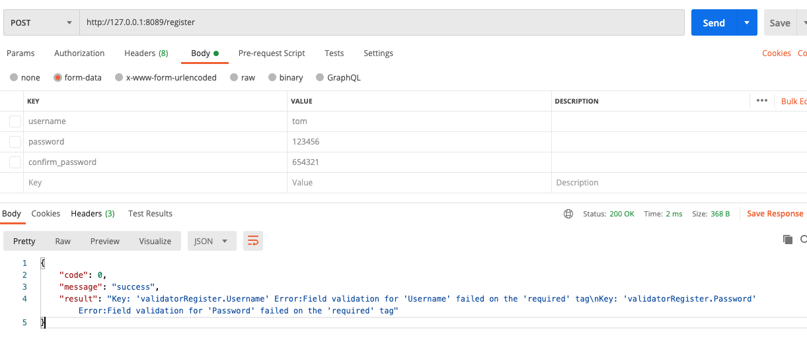
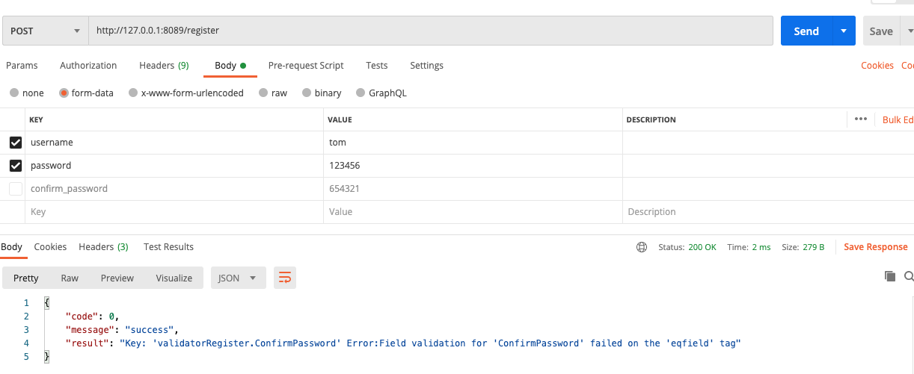
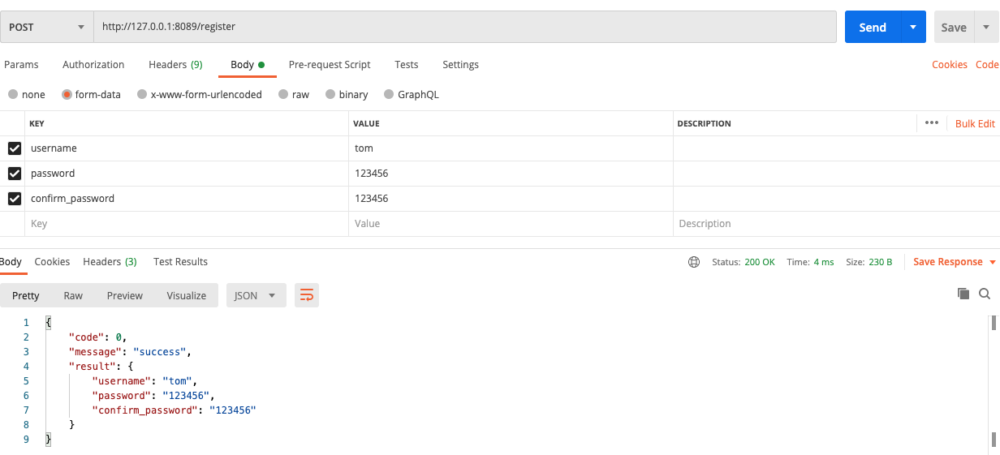
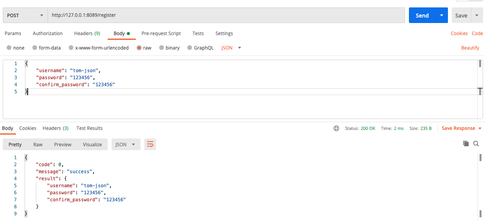

第三方包 [validator](https://github.com/go-playground/validator)

## 跨字段验证

### eqfield 

用途：eqfield=Field  必须等于 Field 的值；

```go
validate := validator.New()
	type RegisterInfo struct {
		Username			string				`validate:"required"`
		Password			string				`validate:"required"`
		ConfirmPassword		string				`validate:"eqfield=Password"`
	}
	registerInfo := RegisterInfo{
		Username: "lisi",
		Password: "123456",
		ConfirmPassword: "654321",
	}
	errs := validate.Struct(registerInfo)
	//验证 ConfirmPassword == Password
	//errs Key: 'RegisterInfo.ConfirmPassword' Error:Field validation for 'ConfirmPassword' failed on the 'eqfield' tag
	fmt.Printf("errs %v", errs)
```

### nefield
用途：nefield=Field: 必须不等于 Field 的值；

### gtfield

用途：gtfield=Field: 必须大于 Field 的值；

### gtefield

用途：gtefield=Field: 必须大于等于 Field 的值；

### ltfield

用途：ltfield=Field: 必须小于 Field 的值；

### ltefield

用途：ltefield=Field: 必须小于等于 Field 的值；

### eqcsfield

用途：eqcsfield=Other.Field: 必须等于 struct Other 中 Field 的值；

### necsfield

用途：necsfield=Other.Field: 必须不等于 struct Other 中 Field 的值；

### gtcsfield

用途：gtcsfield=Other.Field: 必须大于 struct Other 中 Field 的值；

### gtecsfield

用途：gtecsfield=Other.Field: 必须大于等于 struct Other 中 Field 的值；

### ltcsfield

用途：ltcsfield=Other.Field 必须小于 struct Other 中 Field 的值；

### ltecsfield

用途：ltecsfield=Other.Field 必须小于等于 struct Other 中 Field 的值；

```go
validate := validator.New()
	type Inner struct {
		StartDate time.Time
	}
	type Outer struct {
		InnerStructField *Inner
		CreatedAt time.Time      `validate:"ltecsfield=InnerStructField.StartDate"`
	}
	now := time.Now()

	inner := &Inner{
		StartDate: now,
	}
	parse, _ := time.Parse("2006-01-02 15:04:05", "2020-09-23 23:30:10")
	outer := &Outer{
		InnerStructField: inner,
		CreatedAt: parse,
	}
	errs := validate.Struct(outer)
	//CreatedAt 不小于等于 InnerStructField.StartDate
	//errs Key: 'Outer.CreatedAt' Error:Field validation for 'CreatedAt' failed on the 'ltecsfield' tag
	fmt.Printf("errs %v", errs)
```


## 网络相关验证

### cidr

用途：验证字符串值是否包含有效的CIDR地址

### cidrv4

用途：验证字符串值是否包含有效的v4 CIDR地址

### cidrv6

用途：验证字符串值是否包含有效的v6 CIDR地址

### datauri

用途：验证字符串值是否包含有效的DataURI。注意：这也将验证数据部分是否有效base64

### fqdn

用途：验证字符串值是否包含有效的FQDN (完全合格的有效域名)，Full Qualified Domain Name (FQDN)

### hostname

用途：根据[RFC 952](https://tools.ietf.org/html/rfc952) 验证字符串值是否为合法主机名

### hostname_port

用途：验证字符串是否为合法的主机名+端口号

### hostname_rfc1123

用途：根据[RFC 1123](https://tools.ietf.org/html/rfc1123) 验证字符串值是否为有效主机名

### ip

用途：验证字符串值是否是**有效**的IP地址

### ipv4

用途：验证字符串值是否是**有效**的v4 IP地址

### ipv6

用途：验证字符串值是否是**有效**的v6 IP地址

### ip4_addr

用途：验证字符串值是否是**有效的可解析**v4 IP地址

### ip6_addr

用途：验证字符串值是否是**有效的可解析**v6 IP地址

### ip_addr

用途：验证字符串值是否是**有效的可解析**IP地址

### mac

用途：验证字符串值是否是有效的MAC地址

### tcp_addr

用途：验证字符串值是否是有效的可解析TCP地址

### tcp4_addr

用途：验证字符串值是否是有效的可解析v4 TCP地址

### tcp6_addr

用途：验证字符串值是否是有效的可解析v6 TCP地址

### udp_addr

用途：验证字符串值是否是有效的可解析UDP地址

### udp4_addr

用途：验证字符串值是否是有效的可解析v4 UDP地址

### udp6_addr

用途：验证字符串值是否是有效的可解析v6 UDP地址

### unix_addr

用途：验证字符串值是否是有效的Unix地址，即Unix域套接字地址

### uri

用途：验证字符串是否是有效的uri

### url

用途：验证字符串是否是有效的url

```go
validate := validator.New()
	type UrlInfo struct{
		Uri string `validate:"uri"`
		Url string	`validate:"url"`
	}
	uriInfo := UrlInfo{
		// /user/add 合法uri
		Uri: "user/add",
		// http://baidu.com 合法url需要 协议开头
		Url: "baidu.com",
	}
	errs := validate.Struct(uriInfo)
	//errs Key: 'UrlInfo.Uri' Error:Field validation for 'Uri' failed on the 'uri' tag
	//Key: 'UrlInfo.Url' Error:Field validation for 'Url' failed on the 'url' tag
	fmt.Printf("errs %v", errs)
```


### url_encoded

用途：验证字符串是否符合url_encode后的值

```go
validate := validator.New()
	type UrlInfo struct{
		Uri 		string `validate:"uri"`
		Url 		string	`validate:"url"`
		UrlEncode 	string	`validate:"url_encoded"`
	}
	uriInfo := UrlInfo{
		Uri: "/user/add",
		Url: "http://baidu.com",
		// http%3A%2F%2Fbaidu.com
		UrlEncode: "http://baidu.com",
	}
	errs := validate.Struct(uriInfo)
	//errs Key: 'UrlInfo.UrlEncode' Error:Field validation for 'UrlEncode' failed on the 'url_encoded' tag
	fmt.Printf("errs %v", errs)
```


### urn_rfc2141

用途：验证字符串是否是合法Urn RFC 2141 的字符串


## 字符串相关验证

### alpha

用途：验证字符串值是否仅包含ASCII字母字符

### alphanum

用途：验证字符串值是否仅包含ASCII字母数字字符

### alphanumunicode

用途：验证字符串值是否仅包含unicode字符验证字符串值是否仅包含unicode字母数字字符

### alphaunicode

用途：验证字符串值是否仅包含unicode字符

### ascii

用途：验证字符串值是否仅包含ASCII字符。注意：如果字符串为空，则验证为true

```go
validate := validator.New()
	type alphaInfoStruct struct{
		Alpha 				string 	`validate:"alpha"` //是否仅包含ASCII字母字符
		Alphanum 			string	`validate:"alphanum"` //是否仅包含ASCII字母数字字符
		Alphanumunicode 	string	`validate:"alphanumunicode"` //是否仅包含unicode字母数字字符
		Alphaunicode 		string	`validate:"alphaunicode"` //是否仅包含unicode字符
		Ascii				string 	`validate:"ascii"` //是否仅包含ASCII字符。注意：如果字符串为空，则验证为true
	}
	alphaInfo := alphaInfoStruct{
		Alpha: "abc",
		Alphanum: "abc134",
		Alphanumunicode: "你好世界helloworld123",
		Alphaunicode: "你好世界helloworld",
		Ascii: "@)*",
	}
	errs := validate.Struct(alphaInfo)
	fmt.Printf("errs %v", errs)
```


### contains

用途：contains=@   验证字符串值是否包含子字符串值

### containsany

用途：containsany=!@#?    验证字符串值是否包含子字符串值中的任何Unicode code points

### containsrune

用途：containsrune=@    验证字符串值是否包含提供的符文值

```go
	validate := validator.New()
	type containsStruct struct {
		Contains			string		`validate:"contains=需要完全包含这里的整个字符串"`
		Containsany			string		`validate:"containsany=至少需要包含任何一个这里的字符"`
		Containsrune		string		`validate:"containsrune=至少需要包含任何一个这里的字符"`
	}
	contains := containsStruct{
		Contains: "需要完全包含这里的整个字符串",
		Containsany: "至少一个字符有交叉",
		Containsrune: "至少一个字符有交叉",
	}
	errs := validate.Struct(contains)
	fmt.Printf("errs %v", errs)
```

### excludes

用途：验证字符串不能包含指定字符串；eg：excludes=hi，字符串不能包含"hi"

### excludesall

用途：验证字符串值在子字符串值中是否包含任何Unicode code points

### excludesrune

用途：验证字符串值是否包含提供的符文值

```go
	validate := validator.New()
	type excludesStruct struct {
		Excludes			string		`validate:"excludes=字符串中不能出现这里的整个子字符串"`
		Excludesall			string		`validate:"excludesall=字符串中不能包含任何这里的一个字符"`
		Excludesrune		string		`validate:"excludesrune=字符串中不能包含任何这里的一个字符"`
	}
	excludes := excludesStruct{
		Excludes: "字符串中不能出现这里的【插入hello world就可以验证通过】整个子字符串",
		Excludesall: "hello world通不过验证因为出现了相同字符",
		Excludesrune: "字符串中不能包含任何这里的一个字符",
	}
	errs := validate.Struct(excludes)
	fmt.Printf("errs %v", errs)
```


### lowercase

用途：字符串不能为空，并且不能出现大写字符，可以出现中文

### uppercase

用途：字符串不能为空，并且不能出现小写字符，可以出现中文

### multibyte

用途：验证字符串值是否包含一个或多个**多字节字符**。注意：如果字符串为空，则验证为true

```go
validate := validator.New()
	type stringStruct struct{
		Lowercase 			string 	`validate:"lowercase"`
		Uppercase 			string	`validate:"uppercase"`
		Multibyte 			string	`validate:"multibyte"`
	}
	info := stringStruct{
		Lowercase: "lowercase不能出现大写字母；可以出现中文；不能为空", //验证通过
		Uppercase: "UPPERCASE不能出现小写字母；可以出现中文；不能为空", //验证通过
		Multibyte: "Multibyte至少包含一个多字节字符",	//验证通过
	}
	errs := validate.Struct(info)
	fmt.Printf("errs %v", errs)
```


### number

用途：验证字符串是否全是数字[不包括浮点数字符串]，对于整型或者浮点数可以通过验证

### numeric

用途：验证字符串是否全是基本数字[包括浮点数字符串，不包括指数等数值]，对于整型或者浮点数可以通过验证

```go
validate := validator.New()
	type numberStruct struct {
		NumberString	string	`validate:"number"`
		NumberInt		int		`validate:"number"`
		NumberFloat		float32	`validate:"number"`
		NumericString	string	`validate:"numeric"`
		NumericInt		int		`validate:"numeric"`
		NumericFloat	float64	`validate:"numeric"`
	}
	info := numberStruct{
		NumberString: "123456",
		NumberInt: 31415,
		NumberFloat: 3.1415,
		NumericString: "31415",
		NumericInt: 31415,
		NumericFloat: 3.1415,
	}
	errs := validate.Struct(info)
	fmt.Printf("errs %v", errs)
```


### printascii

用途：验证字符串值是否仅包含可打印的ASCII字符。注意：如果字符串为空，则验证为true。

### startswith

用途：startswith=hi 验证字符串是否是指定字符串开头

### endswith

用途：验证字符串是否一xxx结尾；eg：endswith=hi，字符串是否以"hi"结尾

## 格式化相关验证

### base64

用途：验证字符串值是否是有效的base64值。虽然空字符串是有效的base64，但这会将空字符串报告为错误，如果希望接受空字符串作为有效字符，则可以将此字符串与omitempty标记一起使用，eg:base64,omitempty。

### base64url

用途：根据RFC4648规范验证字符串值是否包含有效的base64 URL安全值。尽管空字符串是有效的base64 URL安全值，但这会将空字符串报告为错误，如果您希望接受空字符串作为有效字符，则可以将此字符串与omitempty标记一起使用。

### btc_addr

用途：验证字符串值是否包含有效的比特币地址。检查字符串的格式以确保它匹配P2PKH，P2SH三种格式之一并执行校验和验证

### btc_addr_bech32

用途：验证了字符串值包含[bip-0173](https://github.com/bitcoin/bips/blob/master/bip-0173.mediawiki)定义的有效比特币Bech32地址特别感谢Pieter Wuille提供的参考实现。

### datetime

用途：验证字符串是否支持格式化为datetime=2006-01-02 15:04:05

### email

用途：验证字符串是否是合法email

### eth_addr

用途：验证字符串是否是合法的以太坊地址

### hexadecimal

用途：验证字符串是否是有效的十六进制

### hexcolor

用途：验证字符串值包含有效的十六进制颜色，包括＃标签（＃）

### hsl

用途：验证字符串值是否包含有效的hsl颜色

### hsla

用途：验证字符串值是否包含有效的hsla颜色

### html

用途：验证字符串是否是html标签

```go
	validate := validator.New()
	type htmlStruct struct {
		Html	string	`validate:"html"`
	}
	info := htmlStruct{
		Html: "<ab></ab>html包含html标签就行",
	}
	errs := validate.Struct(info)
	fmt.Printf("errs %v", errs)
```


### html_encoded

用途：验证字符串值是十进制或十六进制格式的正确字符引用

### isbn

用途：验证字符串值是否包含有效的isbn10或isbn13值，【图书书号】

### isbn10

用途：验证字符串值是否包含有效的isbn10值

### isbn13

用途：验证字符串值是否包含有效的isbn13值

### json

用途：验证字符串是否是合法的json

### latitude

用途：验证字符串值是否包含有效的纬度

### longitude

用途：验证字符串值是否包含有效经度

### rgb

用途：验证字符串值是否包含有效的rgb颜色

### rgba

用途：验证字符串值是否包含有效的rgba颜色

### ssn

用途：验证字符串值是否包含有效的美国社会安全号码

### uuid

用途：验证字符串值是否包含有效的UUID

### uuid3

用途：验证字符串值是否包含有效的版本3 UUID

### uuid4

用途：验证字符串值是否包含有效的版本4 UUID

### uuid5

用途：验证字符串值是否包含有效的版本5 UUID

## 比较相关验证

### eq

用途：对于字符串和数字，eq将确保该值等于给定的参数。对于切片，数组和map，验证元素个数是否等于给定个数

```go
	validate := validator.New()
	type eqStruct struct {
		EqString	string				`validate:"eq=字符串"`
		EqInt		int					`validate:"eq=3"`
		EqFloat		float32				`validate:"eq=3.1"`
		EqSlice		[]string			`validate:"eq=3"`
		EqMap		map[string]string	`validate:"eq=3"`
	}
	info := eqStruct{
		EqString: "字符串", //验证字符串相对
		EqInt: 3,			//验证数字相等
		EqFloat: 3.1,		//浮点数通不过验证
		EqSlice: []string{"1", "2", "3"}, //slice 元素个数
		EqMap: map[string]string{"name": "lisi", "age": "20", "hobby": "play game"}, //map 元素个数
	}
	errs := validate.Struct(info)
	//errs Key: 'eqStruct.EqFloat' Error:Field validation for 'EqFloat' failed on the 'eq' tag相等
	fmt.Printf("errs %v", errs)
```


### gt

用途：对于数字，这将确保该值大于给定的参数。对于字符串，它会检查字符串长度是否大于该字符数。对于切片，数组和map，它会验证元素个数是否大于给定个数。

### gte

用途：对于数字，这将确保该值大于等于给定的参数。对于字符串，它会检查字符串长度是否大于等于该字符数。对于切片，数组和map，它会验证元素个数是否的大于等于给定个数。

### lt

用途：对于数字，这将确保该值小于给定的参数。对于字符串，它会检查字符串长度是否小于该字符数。对于切片，数组和map，它会验证元素个数是否小于给定个数。

### lte

用途：对于数字，这将确保该值小于等于给定的参数。对于字符串，它会检查字符串长度是否小于等于该字符数。对于切片，数组和map，它会验证元素个数是否小于等于给定个数。

### ne

用途：对于字符串和数字，ne将确保该值不等于给定的参数。对于切片，数组和map，验证元素个数是否不等于给定个数

## 其他验证

### dir

用途：验证给定的字符串是否是一个合法的目录，并且是否存在当前机器上

### file

用途：验证字符串值是否包含有效的文件路径，并且该文件存在于当前计算机上

```go
validate := validator.New()
	type fileDirStruct struct {
		Dir			string				`validate:"dir"`
		File		string				 `validate:"file"`
	}
	info := fileDirStruct{
		Dir: "/tmp", 			///tmp 目录存在 验证通过
		File: "/tmp/mysql.sock", ///tmp/mysql.sock 文件存在验证通过
	}
	errs := validate.Struct(info)
	fmt.Printf("errs %v", errs)
```


### isdefault

用途：验证了该值是默认值，与必填值相反

```go
	validate := validator.New()
	type isdefaultStruct struct {
		Isdefault		bool			`validate:"isdefault"`
	}
	info := isdefaultStruct{
		Isdefault: false, 			// bool 类型默认值：false 通过验证
	}
	errs := validate.Struct(info)
	fmt.Printf("errs %v", errs)
```


### len

用途：对于数字，长度将确保该值等于给定的参数。对于字符串，它会检查字符串长度是否与字符数完全相同。对于切片，数组和map，验证元素个数是否与给定值相等；eg：len=10，10个字符中英文算一个

```go
validate := validator.New()
	type lenStruct struct {
		LenString	string				`validate:"len=3"`
		LenInt		int					`validate:"len=3"`
		LenSlice		[]string			`validate:"len=3"`
		LenMap		map[string]string	`validate:"len=3"`
	}
	info := lenStruct{
		LenString: "字符串", //验证字符个数，中英文算一个
		LenInt: 3,			//验证数字相等
		LenSlice: []string{"1", "2", "3"}, //slice 元素个数
		LenMap: map[string]string{"name": "lisi", "age": "20", "hobby": "play game"}, //map 元素个数
	}
	errs := validate.Struct(info)
	fmt.Printf("errs %v", errs)
```


### max

用途：对于数字，max将确保该值小于或等于给定的参数。对于字符串，它会检查字符串长度是否最多为该字符数。对于切片，数组和map，验证元素个数小于等于给定的数值

### min

用途：对于数字，min将确保该值大于或等于给定的参数。对于字符串，它会检查字符串长度是否最少为该字符数。对于切片，数组和map，验证元素个数大于等于给定的数值

### oneof

用途：对于字符串，整数和uint，oneof将确保该值是参数中的值之一。参数应该是由空格分隔的值列表。值可以是字符串或数字；eg：oneof=1 3 输入值必须是1或者3其中的任意一个

```go
validate := validator.New()
	type oneofStruct struct {
		OneOfString	string						`validate:"oneof='12' '13'"`
		OneOfInt	int							`validate:"oneof=1 2"`
		OneOfInterface	interface{}				`validate:"oneof=1 2 a"`
	}
	info := oneofStruct{
		OneOfString: "12",
		OneOfInt: 2,
		OneOfInterface: "a",
	}
	errs := validate.Struct(info)
	fmt.Printf("errs %v", errs)
```


### required

用途：验证该值不是数据类型的默认零值。数字不为０，字符串不为 " ", slices, maps, pointers, interfaces, channels and functions 不为 nil

### required_with

用途：required_with=Field1 只有Field1 required的时候，当前字段验证才生效

### required_with_all

用途：required_with_all=Field1 Field2 只有Field1 Field2 required的时候，当前字段验证才生效

```go
validate := validator.New()
	type requireStruct struct {
		Username			string
		Age					int				`validate:"required_with=Username"` //当Username有值 required 现在才生效
		Height				uint8			`validate:"required_with_all=Username Age"` //当Username Age 都有值 required 现在才生效
	}
	info := requireStruct{
		Username: "",
	}
	errs := validate.Struct(info)
	fmt.Printf("errs %v \n", errs)


	info = requireStruct{
		Username: "lisi",
	}
	errs = validate.Struct(info)
	//errs Key: 'requireStruct.Age' Error:Field validation for 'Age' failed on the 'required_with' tag
	fmt.Printf("errs %v \n", errs)

	info = requireStruct{
		Username: "lisi",
		Age: 20,
	}
	errs = validate.Struct(info)
	//errs Key: 'requireStruct.Height' Error:Field validation for 'Height' failed on the 'required_with_all' tag
	fmt.Printf("errs %v \n", errs)

	info = requireStruct{
		Username: "lisi",
		Age: 20,
		Height: 175,
	}
	errs = validate.Struct(info)
	fmt.Printf("errs %v \n", errs)
```


### required_without

用途：required_without=Field1 只有Field1 没有值或者不存在的时候，当前字段验证才生效

### required_without_all

用途：required_without_all=Field1 Field2 只有Field1 Field2 都没有值或者都不存在的时候，当前字段验证才生效

### unique

用途：对于数组和切片，unique将确保没有重复项。对于map，unique将确保没有重复值

```go
package main

import (
	"fmt"
	"github.com/go-playground/validator/v10"
)

var validate *validator.Validate

func main()  {
	validate = validator.New()

	type Elem struct{
		Name string
		Age  uint8
	}
	var mystruct struct{
		Name  string 	`validate:"len=2"`
		Hobby []string  `validate:"unique"`
		Person []Elem	`validate:"unique=Name,unique=Age"`

	}
	mystruct.Name = "12"
	mystruct.Hobby = []string{"a", "b"}
	mystruct.Person = []Elem{
		{
			Name:"lisi",
			Age: 23,
		},
		{
			Name:"lisi",
			Age: 23,
		},
	}
	err := validate.Struct(mystruct)
	validationErrors, ok := err.(validator.ValidationErrors)
	fmt.Println(validationErrors, ok)
}
```

## 自定义验证方法

```go
var validate *validator.Validate

func init()  {
	validate =  validator.New()
  //注册验证方法
	_ = validate.RegisterValidation("custom", customFunc)
}

//自定义验证方法 这自定义方法里面做校验，
func customFunc(fl validator.FieldLevel) bool {
	fmt.Printf("fl.Param %v \n", fl.Param())
	fmt.Printf("fl.GetTag %v \n", fl.GetTag())
	fmt.Printf("fl.Field %v \n", fl.Field())
	fmt.Printf("fl.FieldName %v \n", fl.FieldName())
	value, kind, nullable := fl.ExtractType(fl.Field())
	fmt.Printf("fl.ExtractType(fl.Field()) value:%v kind:%v nullabel:%v \n", value, kind, nullable)
	fmt.Println("=============")
	return true
}
//测试校验
func custom()  {
	type customStruct struct {
		Username 					string
		Custom						string		`validate:"custom=这是验证参数"`
		CustomParent				string		`validate:"custom=Username"`
	}
	excludes := customStruct{
		Username: "用户名称",
		Custom: "这是传递参数",
		CustomParent: "这是parent传递参数",
	}
  /**
	fl.Param 这是验证参数 
	fl.GetTag custom 
	fl.Field 这是传递参数 
	fl.FieldName Custom 
	fl.ExtractType(fl.Field()) value:这是传递参数 kind:string nullabel:false 
	=============
	fl.Param Username 
	fl.GetTag custom 
	fl.Field 这是parent传递参数 
	fl.FieldName CustomParent 
	fl.ExtractType(fl.Field()) value:这是parent传递参数 kind:string nullabel:false 
	=============
	 */
	errs := validate.Struct(excludes)

	fmt.Printf("errs %v", errs)
}

```

## gin中validator

通过 binding tag 来绑定 validator的验证方法

```go
package main

import (
	"fmt"
	"github.com/gin-gonic/gin"
)

type validatorRegister struct {
	Username 			string			`form:"username" json:"username" binding:"required"`
	Password 			string			`form:"password" json:"password" binding:"required,min=6,max=12"`
	ConfirmPassword 	string			`form:"confirm_password" json:"confirm_password" binding:"eqfield=Password"`
}


func main()  {
	r := gin.Default()
	r.POST("/register", func(c *gin.Context) {

		var params validatorRegister
		var result interface{}
		err := c.ShouldBind(&params)

		fmt.Printf("params：%v \n", params)
		fmt.Printf("err：%v \n", err)

		if err == nil {
			result = params
		}else{
			result = err.Error()
		}

		c.JSON(200, gin.H{
			"code": 0,
			"message": "success",
			"result": result,
		})
	})
	_ = r.Run("127.0.0.1:8089") 
}

```

1. 所有条件都不符合 form-data 传参
   1. 

2. 密码不一致 
   1. 


3. 所有条件均满足
   1. 

4. post  json 传参
   1. 